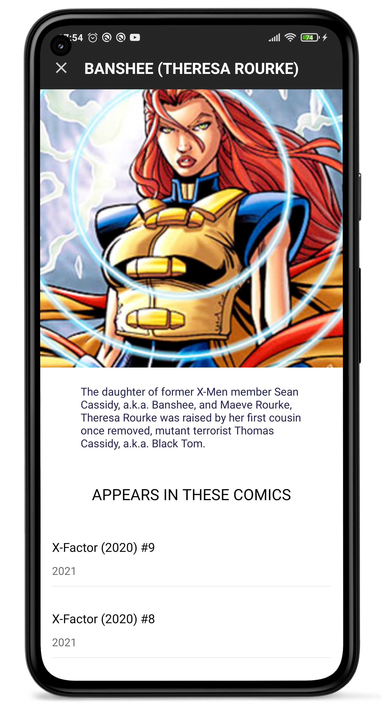

# MarvelChallenge
Comics characters and comics event of Marvel on a single app: with name, image, summary, and release dates, provided by an external API (Marvel).    

## Features
★ This app is fully developed in Kotlin.    
★ Implements NavigationComponent, Firebase, Hilt, LiveData, Retrofit and Glide.    
★ Login with Firebase Email & Facebook.    
★ Main page that shows a TabLayout of two lists: Characters and Events.  
★ Each Character is clickable and opens a second screen where the complete character information is
displayed: name, image, detail and a list of comic appeareances.  
★ Each Event is clickable and expands the list of comics to discuss the Event.  
★ The Character catalog is paged: when scrolling reaches the end (every 15 items), more characters are fetched.

### Screenshots - Light mode

 

API Base URL: https://gateway.marvel.com/  
Distribution folder: https://drive.google.com/drive/folders/1bZ3emcrjsoT7EHnE_OD4gZqns_RY0kHF?usp=sharing

